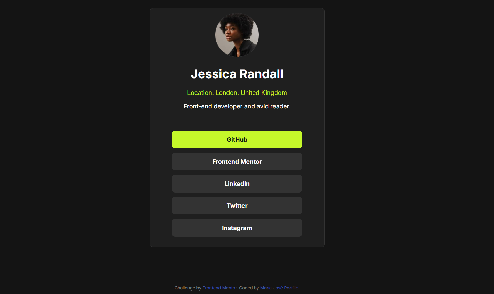

# Frontend Mentor - Social links profile solution

This is a solution to the [Social links profile challenge on Frontend Mentor](https://www.frontendmentor.io/challenges/social-links-profile-UG32l9m6dQ). Frontend Mentor challenges help you improve your coding skills by building realistic projects. 

## Table of contents

- [Overview](#overview)
  - [The challenge](#the-challenge)
  - [Screenshot](#screenshot)
  - [Links](#links)
- [My process](#my-process)
  - [Built with](#built-with)
  - [What I learned](#what-i-learned)
  - [Useful resources](#useful-resources)
- [Author](#author)

## Overview

### The challenge

Users should be able to:

- See hover and focus states for all interactive elements on the page

### Screenshot




### Links

- Solution URL: [Add solution URL here](https://github.com/majoportillo/Card-Social-Links.git)
- Live Site URL: [Add live site URL here](https://rococo-halva-a2343c.netlify.app/)

## My process

### Built with

- Semantic HTML5 markup
- CSS custom properties
- Flexbox
- CSS
- Mobile-first workflow

### What I learned
### What I learned

Through this challenge, I reinforced my knowledge of:

- **Flexbox**: I practiced aligning and centering elements using `justify-content` and `align-items` for responsive layouts.
  
```css
body {
  display: flex;
  flex-direction: column;
  justify-content: center;
  align-items: center;
  min-height: 100vh;
}
```

### Useful resources

- [W3Schools](https://www-w3schools-com.translate.goog/css/css_intro.asp?_x_tr_sl=en&_x_tr_tl=es&_x_tr_hl=es&_x_tr_pto=tc) -This page is quite useful for basic CSS knowledge.

- [Google Fonts](hhttps://fonts.google.com/specimen/Inter) - Multiple font resources; I got the principal font from here.


## Author

- Frontend Mentor - [@majoportillo](https://www.frontendmentor.io/profile/majoportillo)


